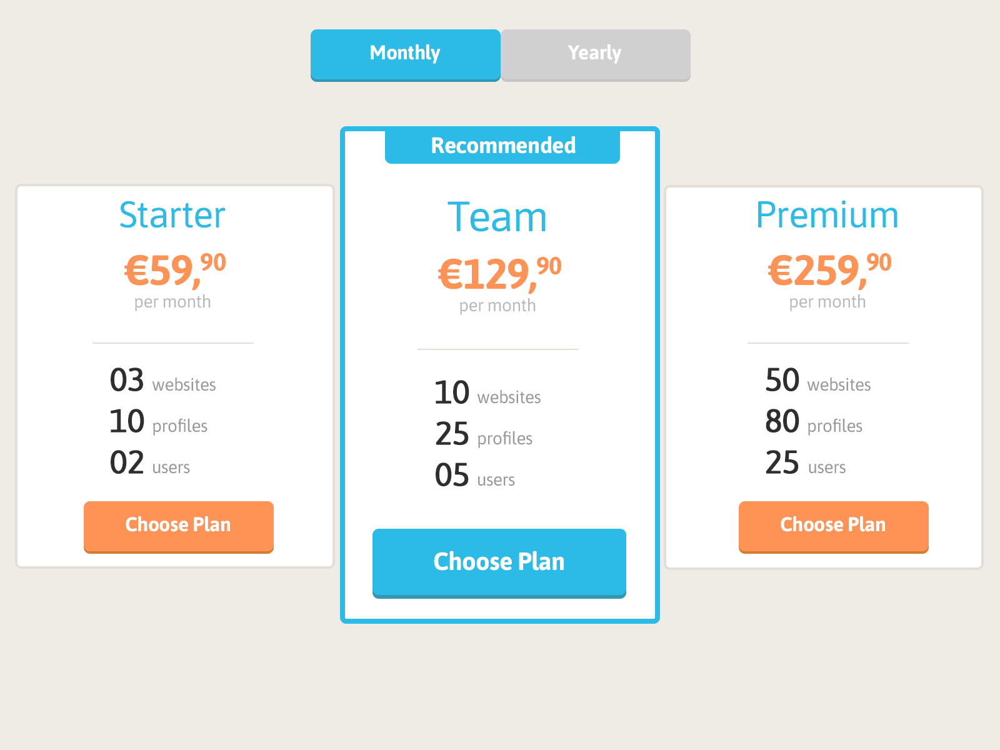

# Start
Please fork this repository and implement your solution there. Once done send us link to your public repository or create a pull request.

## Requirements
 * Node (LTS+)
 * Git
 * Github account

## Run Backend
 1. Open project root in your terminal
 2. Run `npm install`
 3. Run `npm run server`
 4. Server should be exposing 2 endpoints for use:
    * http://localhost:3000/monthlyPlans
    * http://localhost:3000/yearlyPlans

# Task

## Description
Web Agency asked you to create a Price Table component for them. Price Table should show all current plans they offer including plan name, price, description. They offer both Monthly and Yearly pricing plans to their customers. They also want to have option to highlight plans they recommend.

## Design Example

Note that they are not strict on design, they wish only a good solution that fit all the requirements.

## Requirements
 * Component shows Price Plans for time period selected (Yearly or Monthly)
 * Component loads Monthly view by default
 * User can swap between Yearly and Monthly Prices
 * All the data comes from server mentioned above
 * All numbers on the page are presented with a minimum of 2 digits (3 -> 03, 33 -> 33, 333 -> 333, ...)
 * Choosing a plan results into logging plan name to the console.
 * Component has to be mobile and desktop friendly
 * Component can have 3-6 different prices
 * Recommended Plan should be easy to notice incorporating color, size and text

 ## Stack
 * Languages: JS/TS, HTML, SCSS/LESS/CSS
 * Frameworks: Vue, Angular, React
 * UI Components: None, Bootstrap, Material

 Pick any of your choice

